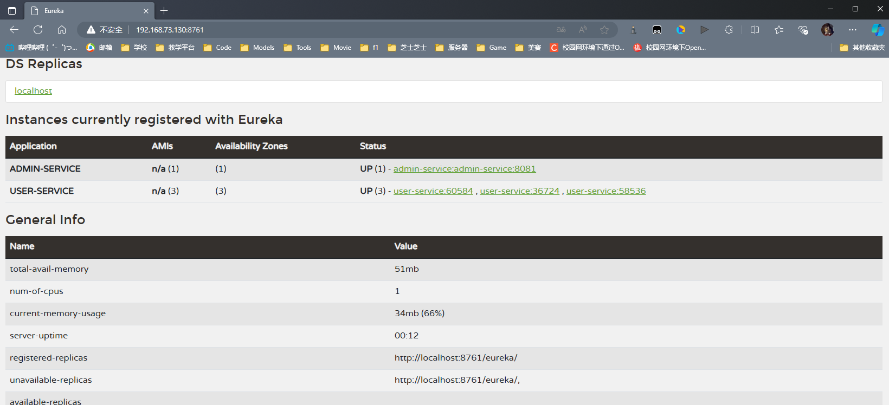
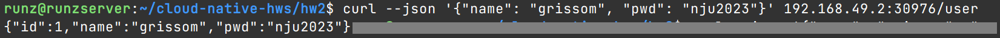
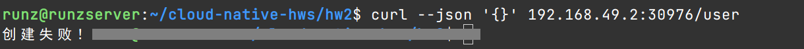
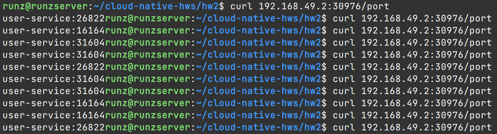

# 云原生 - 第二次作业

221850148 刘存玺

## 模块说明

### Admin-Service

- Controller
    - `/user`: 增加用户api
    - `/port`: 负载均衡测试api

```java
public class UserController {
    @Autowired
    UserService userService;

    // 增加用户api
    @PostMapping("/user")
    @ResponseBody
    public Object add(@RequestBody UserVO userVO) {
        return userService.add(userVO);
    }

    // 负载均衡测试api
    @GetMapping("/port")
    @ResponseBody
    public String port() {
        return userService.port();
    }

}
```

- Service 实现

```java
public class UserService {

    // 远程调用
    @Autowired
    private UserFeign userFeign;

    public Object add(UserVO userVO) {
        // 用户信息为空
        if(userVO.getName() == null || userVO.getPwd() == null) return "创建失败！";
        return userFeign.add(userVO);
    }

    public String port() {
        return userFeign.port();
    }
}
```

- Feign 远程调用

```java
@FeignClient(name = "user-service")
public interface UserFeign {
    @PostMapping("/user")
    UserVO add(UserVO userVO);

    @GetMapping("/port")
    String port();
}
```

- RandomRule 负载均衡模块
    - 采用随机策略，Admin Service的流量可以打到多个User Service上
    - 给启动类加上`@RibbonClient`注解来启用自定义策略

```java
// RandomRule.java
public class RandomRule extends AbstractLoadBalancerRule {

    @Override
    public void initWithNiwsConfig(IClientConfig iClientConfig) {}

    @Override
    public Server choose(Object key) {
        ILoadBalancer lb = getLoadBalancer();
        if(lb == null) return null;

        List<Server> servers = lb.getReachableServers();
        // 如果没有可达服务器，返回空
        if(servers.isEmpty()) return null;
        // 返回随机服务器
        Server selected = servers.get((int)(Math.random() * 114514) % servers.size());
        // 输出日志到控制台
        System.out.println("[Ribbon Custom Rule]: selected server " + selected.getMetaInfo().getInstanceId());
        return selected;

    }

}
// AdminServiceApplication.java
@SpringBootApplication
@EnableFeignClients
@RibbonClient(name = "ADMIN-SERVICE", configuration = RandomRule.class)
public class AdminServiceApplication {

    public static void main(String[] args) {
        SpringApplication.run(AdminServiceApplication.class, args);
    }

}
```

### User-Service

- Controller
    - GET-`/user`: 根据id获取用户信息，这次作业里没用
    - POST-`/user`: 添加用户，admin-service远程调用
    - `/port`: 负载均衡调试，admin-service远程调用

```java
// UserController.java
public class UserController {
	@Autowired
	private UserService userService;

	@PostMapping("/user")
	public User add(@RequestBody User user) {
		return userService.add(user);
	}

	@GetMapping(path = "/user", produces = MediaType.APPLICATION_JSON_VALUE)
	public UserVO get(@RequestParam("id") long id) {
		User u = userService.get(id);
		return new UserVO(u.getId(), u.getName(), u.getPwd());
	}

}

// UserServiceApplication.java
public class UserServiceApplication {

	public static void main(String[] args) {
		SpringApplication.run(UserServiceApplication.class, args);
	}

	@Value("${eureka.instance.instance-id}")
	private String port;

	@GetMapping("/port")
	@ResponseBody
	public String port(){
		return port;
	}
}
```

- 其他代码与模板一致

### Eureka-Service

- 给启动类加上`@EnableEurekaServer`注解即可，其他细节略

## 启动集群

- 启动有1个Node的集群

    ```bash
    minikube start --image-mirror-country='cn' --container-runtime='containerd' --driver=docker --force-systemd=true
    ```

## 镜像构建

### Dockerfile

均采用**多阶段构建**，以Admin-Service为例，另外两个服务与此基本一致

> 需要安装`docker-buildx`，即buildkit才能正常构建。或者你也可以把第一阶段从`--mount`一直到`mvn`之前的部分删掉，然后享受build一下20分钟的极致体验XD
>
> 说不定maven源换成阿里云会好一些，没试

```dockerfile
# ==========第一阶段-打包构建jar==========
FROM maven:3.8.7-eclipse-temurin-8 AS compile-stage

ENV PROJECT_NAME admin-service
ENV WORK_PATH /usr/src/$PROJECT_NAME

ADD . $WORK_PATH

WORKDIR $WORK_PATH

# 使用buildkit构建，加快构建速度，并且缓存maven依赖
RUN --mount=type=cache,target=/root/.m2,id=maven-cache mvn -B -Dmaven.test.skip clean package
# 非buildkit版本
# RUN mvn -B -Dmaven.test.skip clean package

# ==========第二阶段-部署运行jar==========
FROM eclipse-temurin:8u372-b07-jre-centos7 AS deploy-stage

ENV PROJECT_NAME admin-service
ENV WORK_PATH /usr/src/$PROJECT_NAME
ENV WORK_PATH2 /app

WORKDIR $WORK_PATH2

# 复制上一阶段的jar
COPY --from=compile-stage $WORK_PATH/target/$PROJECT_NAME.jar .

ADD runboot.sh /app/

RUN chmod a+x runboot.sh

CMD ["sh","-c","/app/runboot.sh"]
```

其中的`runboot.sh`

```bash
java ${JAVA_OPS} -Duser.timezone=Asia/Shanghai -Djava.security.egd=file:/dev/./urandom -jar /app/admin-service.jar
```

### 相关命令

以下还是以Admin-Service为例

- 由于使用了**buildkit**，所以先用**docker**构建镜像

    ```bash
    docker build -t admin-service:2024 <dockerfile_path>
    ```

- 将docker的镜像拉到**minikube**里即可

    ```bash
    minikube load admin-service:2024
    ```

### 效果

- docker中的镜像

```
runz@runzserver:~$ docker images
REPOSITORY                    TAG                       IMAGE ID       CREATED         SIZE
admin-service                 2024                      8e1a48e35e72   2 minutes ago   400MB
user-service                  2024                      be38f540357f   22 hours ago    415MB
eureka-service                2024                      f7f949029765   2 days ago      399MB
```

- minikube

```bash
runz@runzserver:~/cloud-native-hws/hw2$ minikube image ls
registry.cn-hangzhou.aliyuncs.com/google_containers/storage-provisioner:v5
...
docker.io/library/user-service:2024
docker.io/library/eureka-service:2024
docker.io/library/admin-service:2024
```

## 部署k8s资源

### YAML文件

#### Admin-Service

```yaml
apiVersion: apps/v1
kind: Deployment
metadata:
  name: admin-service
  labels:
    app: admin-service
spec:
  replicas: 1
  selector:
    matchLabels:
      app: admin-service
  template:
    metadata:
      labels:
        app: admin-service
    spec:
      hostname: admin-service
      containers:
        - name: admin-service
          image: admin-service:2024
          imagePullPolicy: IfNotPresent
          env:
            - name: EUREKA_URL
              value: http://eureka-service:8761/eureka
          ports:
            - containerPort: 8081
          resources:
            requests:
              cpu: 1
              memory: 512Mi
            limits:
              cpu: 1
              memory: 512Mi
---
apiVersion: v1
kind: Service
metadata:
  name: admin-service
  labels:
    app: admin-service
spec:
  type: NodePort
  ports:
    - port: 8081
      targetPort: 8081
  selector:
    app: admin-service
```

#### User-Service

```yaml
apiVersion: apps/v1
kind: Deployment
metadata:
  name: user-service
  labels:
    app: user-service
spec:
  replicas: 3
  selector:
    matchLabels:
      app: user-service
  template:
    metadata:
      labels:
        app: user-service
    spec:
      hostname: user-service
      containers:
        - name: user-service
          image: user-service:2024
          imagePullPolicy: IfNotPresent
          env:
            - name: EUREKA_URL
              value: http://eureka-service:8761/eureka
            - name: DB_URL
              value: mysql://mysql:3306
          ports:
            - containerPort: 8080
          resources:
            requests:
              cpu: 0.2
              memory: 512Mi
            limits:
              cpu: 1
              memory: 512Mi
---
apiVersion: v1
kind: Service
metadata:
  name: user-service
  labels:
    app: user-service
spec:
  type: NodePort
  ports:
    - port: 9090
      targetPort: 9090
  selector:
    app: user-service
```

#### Eureka-Service

```yaml
apiVersion: apps/v1
kind: Deployment
metadata:
  name: eureka-service
  labels:
    app: eureka-service
spec:
  replicas: 1
  selector:
    matchLabels:
      app: eureka-service
  template:
    metadata:
      name: eureka-service
      labels:
        app: eureka-service
    spec:
      hostname: eureka-service
      containers:
        - name: eureka-service
          image: eureka-service:2024
          imagePullPolicy: IfNotPresent
          ports:
            - containerPort: 8761
          resources:
            requests:
              cpu: 1
              memory: 512Mi
            limits:
              cpu: 1
              memory: 512Mi
      restartPolicy: Always
---
apiVersion: v1
kind: Service
metadata:
  name: eureka-service
  labels:
    app: eureka-service
spec:
  type: NodePort
  ports:
    - port: 8761
      targetPort: 8761
  selector:
    app: eureka-service
```

#### MySQL

```yaml
apiVersion: v1
kind: Service
metadata:
  name: mysql
spec:
  ports:
  - port: 3306
  selector:
    app: mysql
  clusterIP: None
---
apiVersion: apps/v1
kind: Deployment
metadata:
  name: mysql
spec:
  selector:
    matchLabels:
      app: mysql
  strategy:
    type: Recreate
  template:
    metadata:
      labels:
        app: mysql
    spec:
      containers:
      - image: mysql:8.0.33
        name: mysql
        env:
        - name: MYSQL_ROOT_PASSWORD
          value: root
        ports:
        - containerPort: 3306
          name: mysql
        volumeMounts:
        - name: mysql-persistent-storage
          mountPath: /var/lib/mysql
      volumes:
      - name: mysql-persistent-storage
        persistentVolumeClaim:
          claimName: mysql-pv-claim
---
apiVersion: v1
kind: PersistentVolume
metadata:
  name: mysql-pv-volume
  labels:
    type: local
spec:
  storageClassName: manual
  capacity:
    storage: 100Mi
  accessModes:
    - ReadWriteOnce
  hostPath:
    path: "/home/runz/cloud-native-hws/hw2/mysql/data"
---
apiVersion: v1
kind: PersistentVolumeClaim
metadata:
  name: mysql-pv-claim
spec:
  storageClassName: manual
  accessModes:
    - ReadWriteOnce
  resources:
    requests:
      storage: 100Mi
```

### 创建资源

- 使用`kubectl apply -f <yaml-path>`创建如上资源

    ```bash
    runz@runzserver:~/cloud-native-hws/hw2$ kubectl apply -f eureka-service/eureka-config.yaml 
    deployment.apps/eureka-service created
    service/eureka-service created
    
    runz@runzserver:~/cloud-native-hws/hw2$ kubectl apply -f mysql/mysql-config.yaml 
    service/mysql created
    deployment.apps/mysql created
    persistentvolume/mysql-pv-volume created
    persistentvolumeclaim/mysql-pv-claim created
    
    runz@runzserver:~/cloud-native-hws/hw2$ kubectl apply -f user-service/user-config.yaml 
    deployment.apps/user-service created
    service/user-service created
    
    runz@runzserver:~/cloud-native-hws/hw2$ kubectl apply -f admin-service/admin-config.yaml 
    deployment.apps/admin-service created
    service/admin-service created
    ```

    

- 进入`MySQL`的pod，并创建user数据库

    - `kubectl exec -it mysql-6d5f6cc6cb-xp6gw -- /bin/bash` 启动pod的交互式bash
    - `mysql -u root -p `使用root账户输入密码后进入数据库，密码在yaml文件环境变量中
    - `create database user;` 创建user数据库

### 执行效果

- Pod状态
    - user-service重启是因为mysql的user数据库没创建，创建了就Running了

```bash
runz@runzserver:~/cloud-native-hws/hw2$ kubectl get po
NAME                             READY   STATUS    RESTARTS       AGE
admin-service-54b68d45bd-68fh6   1/1     Running   0              4m25s
eureka-service-648dfd4c4-84vzp   1/1     Running   0              4m49s
mysql-6d5f6cc6cb-xp6gw           1/1     Running   0              4m40s
user-service-68f98f858f-49ffh    1/1     Running   5 (101s ago)   4m30s
user-service-68f98f858f-gm7w4    1/1     Running   5 (113s ago)   4m30s
user-service-68f98f858f-rrtk2    1/1     Running   5 (101s ago)   4m30s
```

- Service状态

```bash
runz@runzserver:~/cloud-native-hws/hw2$ kubectl get svc
NAME             TYPE        CLUSTER-IP      EXTERNAL-IP   PORT(S)          AGE
admin-service    NodePort    10.108.41.136   <none>        8081:30976/TCP   18m
eureka-service   NodePort    10.106.86.63    <none>        8761:31149/TCP   18m
kubernetes       ClusterIP   10.96.0.1       <none>        443/TCP          36m
mysql            ClusterIP   None            <none>        3306/TCP         18m
user-service     NodePort    10.107.90.3     <none>        9090:31161/TCP   18m
```

- Volume相关资源略

## 功能测试

### Eureka服务情况

- 把虚拟机上的端口转发到物理机上

    ```bash
    kubectl port-forward --address 0.0.0.0 services/eureka-service 8761:8761
    ```

- 访问eureka后台，服务注册正常



### 增加用户

- **正常**增加用户，返回增加的用户的信息，包括id

    ```bash
    runz@runzserver:~/cloud-native-hws/hw2$ curl --json '{"name": "grissom", "pwd": "nju2023"}' 192.168.49.2:30976/user
    {"id":1,"name":"grissom","pwd":"nju2023"}
    ```



- 增加**用户名密码为空**的用户(这里为空是指没有对应参数。如果是字符串为空的话其实也差不多，没必要改了)

    ```bash
    runz@runzserver:~/cloud-native-hws/hw2$ curl --json '{}' 192.168.49.2:30976/user
    创建失败！
    ```



> 截图中有遮住的部分是为了直观，因为curl命令执行结果没换行

### 负载均衡

- 访问`/port`接口，可以看到返回到service的实例id是随机的，并且3个repulica都出现了



- 再看Admin-Service的logs，证实了负载均衡在正常工作

```bash
runz@runzserver:~/cloud-native-hws/hw2$ kubectl logs admin-service-54b68d45bd-68fh6 

  .   ____          _            __ _ _
 /\\ / ___'_ __ _ _(_)_ __  __ _ \ \ \ \
( ( )\___ | '_ | '_| | '_ \/ _` | \ \ \ \
 \\/  ___)| |_)| | | | | || (_| |  ) ) ) )
  '  |____| .__|_| |_|_| |_\__, | / / / /
 =========|_|==============|___/=/_/_/_/
 :: Spring Boot ::       (v2.3.12.RELEASE)
...
省略中间
...
2024-07-17 21:20:56.453  INFO 7 --- [trap-executor-0] c.n.d.s.r.aws.ConfigClusterResolver      : Resolving eureka endpoints via configuration
[Ribbon Custom Rule]: selected server user-service:36724
[Ribbon Custom Rule]: selected server user-service:58536
[Ribbon Custom Rule]: selected server user-service:60584
[Ribbon Custom Rule]: selected server user-service:60584
[Ribbon Custom Rule]: selected server user-service:36724
[Ribbon Custom Rule]: selected server user-service:60584
[Ribbon Custom Rule]: selected server user-service:60584
[Ribbon Custom Rule]: selected server user-service:58536
[Ribbon Custom Rule]: selected server user-service:58536
[Ribbon Custom Rule]: selected server user-service:36724
```

> curl得到user-service的随机数id和admin-service日志中的id不同，原因在于application.yml中的instance-id为\${spring.application.name}:${random.int(10000,65536)}
>
> 冒号前面都是一样的user-service
>
> 冒号后面的random就出问题了，random.int会在注册eureka服务和调用/port接口分别生成两次随机数，所以会造成id不同。不过二者是一一对应的，所以仅供参考没啥问题
